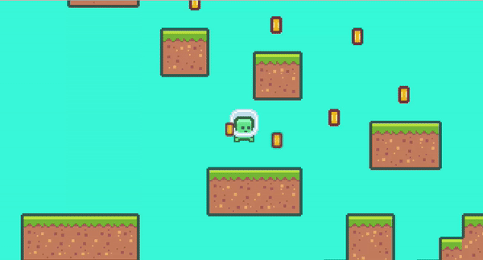

<h1 align="center">Godot Platformer</h1>

<h2 align="center">Game Platformer Project made using Godot 3 and GDScript</h2>

Using Godot Version 3.5.2-stable

Dowload the .zip file, clone or fork the project here on Github

Download Godot 3.5.2 or higher (Godot > 3.5), double click and run the project<a href="https://godotengine.org/article/maintenance-release-godot-3-5-2/"> Download Godot here<a>

  

  

